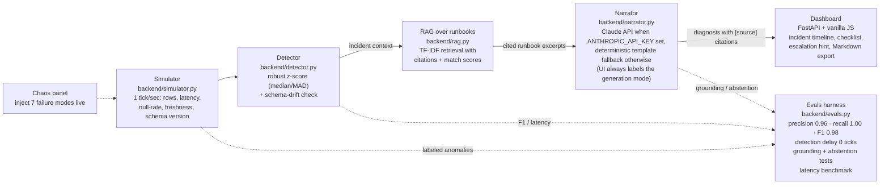

# ⚡ DataPulse — GenAI Data Reliability Copilot


**ML detects, GenAI explains.** A live data-pipeline watchdog where an ML
anomaly detector flags telemetry issues and a GenAI copilot writes the
root-cause diagnosis — grounded in a runbook library, with citations and an
eval harness to prove it works.

## Why this exists

Data downtime is expensive, but most "AI observability" demos are black
boxes. DataPulse shows the full loop that hiring managers actually ask
about in Data Scientist / Applied AI interviews:

```
telemetry ──► ML detection ──► RAG over runbooks ──► GenAI diagnosis
(robust z-score    (citations,          (abstains instead of
 + schema-drift)   abstention)          hallucinating)
```

## Features

- **Live pipeline simulator** — emits rows, latency, null-rate, freshness,
  schema version every second (seeded, reproducible).
- **ML anomaly detection** — robust z-score (median/MAD, immune to baseline
  contamination) + discrete schema-drift check. (An IsolationForest layer
  was evaluated and removed — ablation showed zero added value;
  see `backend/baseline_report.md`.)
- **Chaos panel** — inject 7 failure modes live: volume spike/drop, latency
  spike, null surge, schema change, stale feed, duplicate surge. Detection delay: **0 ticks**.
- **GenAI root-cause narration** — incident context + retrieved runbook
  excerpts → concise diagnosis with `[source]` citations. Claude API when
  `ANTHROPIC_API_KEY` is set, deterministic template fallback otherwise
  (the UI always labels which mode produced the text).
- **Abstention guardrail** — off-topic questions get "not in the runbooks"
  instead of a hallucinated answer.
- **Copilot Q&A** — ask about pipeline failures in plain English, answered
  from the runbooks.
- **Eval harness** (`backend/evals.py`) — detection precision/recall/F1 per
  anomaly, detection delay, narration-grounding checks, abstention test.

## Eval results (synthetic, seeded & reproducible)

| anomaly | tick-recall | detection delay |
|---|---|---|
| volume_spike | 1.00 | 0 ticks |
| volume_drop | 1.00 | 0 ticks |
| latency_spike | 1.00 | 0 ticks |
| null_surge | 1.00 | 0 ticks |
| schema_change | 1.00 | 0 ticks |
| stale_feed | 1.00 | 0 ticks |
| duplicate_surge | 1.00 | 0 ticks |

Overall: **precision 0.96 · recall 1.00 · F1 0.98** · all narrations cite a
runbook and label their generation mode · abstention holds.

## Quickstart

```bash
python3 -m venv .venv && source .venv/bin/activate
pip install -r requirements.txt

# run evals (no API key needed)
python -m backend.evals

# start the live demo
uvicorn backend.app:app --port 8000
# open http://localhost:8000
```

Optional: `export ANTHROPIC_API_KEY=...` for Claude-powered narrations.

## Configuration

Detector sensitivity is tunable through environment variables — no code
changes needed to tighten or loosen anomaly detection:

| variable | default | what it does |
|---|---|---|
| `DATAPULSE_Z_THRESH` | `3.5` | Robust z-score cutoff per metric. Lower (e.g. `2.5`) = more sensitive, more alerts; higher (e.g. `5.0`) = quieter, fewer false positives. |

```bash
# example: stricter z-score layer for a noisy pipeline
DATAPULSE_Z_THRESH=5.0 uvicorn backend.app:app --port 8000
```

Invalid (non-numeric) values raise a `ValueError` at startup so a typo
never silently runs with the wrong sensitivity.

## Architecture



## Demo script (60 seconds for a recruiter)

| sec | what to click | what to say |
|-----|---------------|-------------|
| 0–10 | Open the dashboard | "This is DataPulse, a GenAI data-reliability copilot — ML watches the pipeline, and a GenAI copilot writes the root-cause diagnosis." |
| 10–25 | Hit **null surge** in the chaos panel; point at the live charts | "I'll break the pipeline right now. Watch the null-rate chart spike —" |
| 25–40 | Point at the new incident card and the timeline | "Detection fired at tick zero. The copilot pulls the right runbook, cites it, and turns the fix into a 3-step checklist." |
| 40–55 | Ask the copilot: *"what do I do about a null surge?"* | "It answers from the runbook library only — off-topic questions get a refusal instead of a hallucinated answer." |
| 55–60 | Point at the README eval table | "And it's all verified by an eval harness in the repo — F1 0.98, abstention guardrail tested." |

## Roadmap

- [ ] Postgres-backed incident history + weekly reliability report
- [ ] LLM-as-judge scoring for narration quality in evals
- [ ] Slack/PagerDuty webhook on high-severity incidents
- [ ] Real connector: plug in dbt / Airflow metadata instead of the simulator

## Stack

Python · FastAPI · scikit-learn · TF-IDF RAG · Claude API · vanilla JS dashboard
